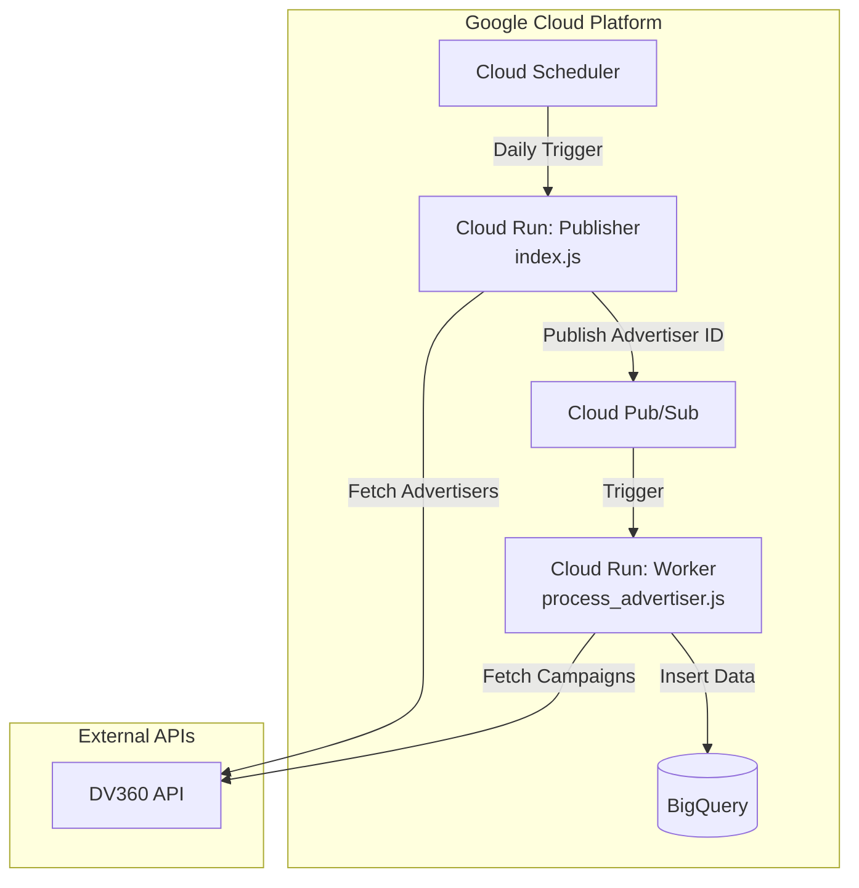

# DV360 Pulse

A serverless application to fetch campaign data from Display & Video 360 (DV360) and store it in BigQuery for analysis. It uses a message-driven architecture with Cloud Pub/Sub to parallelize the extraction of data by advertiser.

## Getting Started

Follow these steps to deploy and run the DV360 campaign extraction pipeline:

1.  **Prepare Credentials**:
    If you don't have a `REFRESH_TOKEN`, `CLIENT_ID` and `CLIENT_SECRET` yet, follow these steps:
    *   Go to the **APIs & Services** -> **Credentials** tab in the Google Cloud Console.
    *   Complete the **OAuth consent screen** if you haven't already.
    *   Click **+ CREATE CREDENTIALS** -> **OAuth client ID**.
    *   Select **Web application** as the application type.
    *   Add `http://localhost` to the **Authorized redirect URIs**.
    *   Click create, and then download the JSON from the credentials list.
    *   Rename the downloaded file to `client_secret.json` and place it in the project root. e.g. use ```nano client_secret.json```, paste the content and save it by pressing ```Ctrl + X```, then ```Y```, then ```Enter```.
    *   Run `npm install` to install the required dependencies.
    *   Run `node auth.js`. Visit the printed URL to authorize. The script will automatically capture the code on port 3000 and print your `refresh_token`.

2.  **Run the Installation Script**:
    Run the deployment script. It will interactively prompt you for the inputs below or read them from your environment variables:
    *   `PARTNER_ID`: Your DV360 partner ID.
    *   `CLIENT_ID`: Your OAuth 2.0 Client ID.
    *   `CLIENT_SECRET`: Your OAuth 2.0 Client Secret.
    *   `REFRESH_TOKEN`: Your OAuth 2.0 Refresh Token.

    The script will automatically handle:
    *   Enabling necessary Google Cloud APIs.
    *   Creating a Google Cloud Storage bucket and uploading credentials.
    *   Creating the required Pub/Sub topics.
    *   Creating the BigQuery dataset and table.
    *   Deploying both the fetch and process Cloud Run functions.
    *   Setting up a Cloud Scheduler job to run the pipeline daily.

## Project Structure

The project consists of the following JavaScript files:

### 1. `auth.js`
*   **Role**: Setup & Authentication Helper (optional)
*   **Description**: A local CLI script used to generate initial OAuth2 refresh tokens for DV360 authentication. Run this locally to authorize the app and get credentials for deployment.

### 2. `dv360.js`
*   **Role**: API Client Wrapper
*   **Description**: A utility client class to handle interaction with the DV360 API. It manages OAuth2 credentials and provides helper methods for paginated listing of advertisers and campaigns.

### 3. `index.js`
*   **Role**: Entry Point & Publisher
*   **Description**: The entry point for the DV360 data fetch process. It fetches all advertiser IDs for a partner and publishes them to a Pub/Sub topic for parallel processing. It also exposes the `processAdvertiser` function.

### 4. `process_advertiser.js`
*   **Role**: Background Worker
*   **Description**: Handles the processing of individual DV360 advertisers. It is triggered by Pub/Sub messages containing an `advertiserId`, fetches all campaigns for that advertiser, and inserts them into BigQuery.


## Architecture


