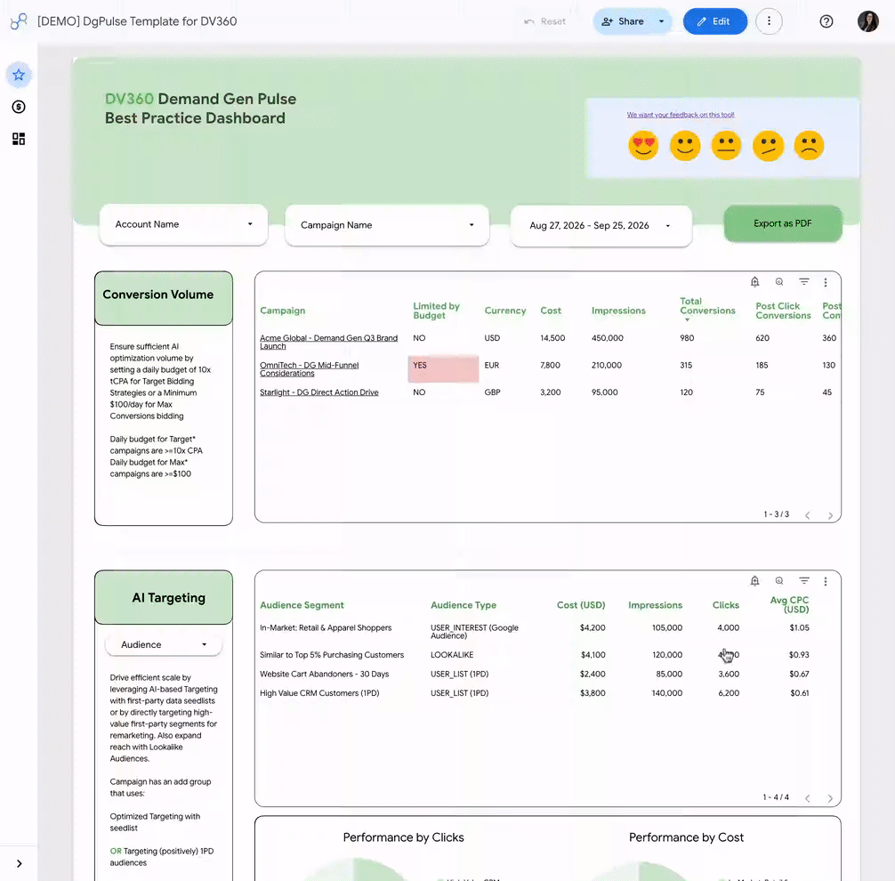

# DemandGen-Pulse for DV360

> [!NOTE]
> **This guide is for Display & Video 360 (DV360).** Running Demand Gen through
> **Google Ads**? Use the [main DGPulse guide](../README.md) instead.

In this README, you'll find:

- [Problem Statement](#problem-statement)
- [Solution](#solution)
- [Deliverable (Implementation)](#deliverable-implementation)
- [Prerequisites](#prerequisites)
- [Installation](#installation)
- [Architecture](#architecture)
- [Troubleshooting / Q&A](#troubleshooting)
- [Disclaimer](#disclaimer)

## Problem Statement

Reporting on Demand Gen campaigns bought through Display & Video 360 is
cumbersome. Advertisers and agencies need a simple way to see an overview of
their DV360 partners and advertisers, check that campaigns follow Demand Gen
best practices, and get a clear picture of budget pacing and asset
performance.

## Solution

DGPulse for DV360 is a best practice dashboard that gives you one place to
monitor Demand Gen campaigns running in DV360. Built in Data Studio, it
shows whether campaigns, line items and assets follow Demand Gen best
practices, and gives actionable insights across:

- **Foundation:** first-party data signals (CRM / Customer Match and Google
  Analytics audiences) and Google Tag Gateway readiness.
- **Activation:** Floodlight optimization and conversion tracking on every
  Demand Gen line item.
- **Budget pacing:** insertion order pacing against the active budget segment,
  with alerts for underpacing, overpacing and exhausted budgets.
- **Creative variety:** video and image aspect ratio coverage (9:16, 1:1, 16:9,
  4:5), headlines, descriptions and product feeds.
- **Asset and audience performance:** delivery and efficiency per asset and per
  audience segment, with deep links back into DV360 and YouTube.

## Deliverable (Implementation)

A Data Studio dashboard based on your DV360 and YouTube data. After joining
[this group](https://groups.google.com/g/dgpulse-dv360-template-readers),
[click here](https://lookerstudio.google.com/reporting/8052b105-d00c-4cb8-bc32-864fe4fe827f)
to see it in action.

[](https://lookerstudio.google.com/reporting/8052b105-d00c-4cb8-bc32-864fe4fe827f)

- Data Studio dashboard based on your DV360 and YouTube data.

## Prerequisites

1. Join [this group](https://groups.google.com/g/dgpulse-dv360-template-readers)
   to get access to the Data Studio template.

1. Have **DV360 access** to the partner you want to report on. Read-only user
   access is enough.

   > No developer token is needed. DV360 uses standard Google OAuth, which you
   > set up in step 4.

1. Create a new Google Cloud Project on the
   [Google Cloud Console](https://console.cloud.google.com/), **make sure it is
   connected to a billing account**, and that you have **Owner** access.

1. Set up OAuth credentials in that project:

   a. Go to **APIs & Services > OAuth consent screen**. Choose **Internal** if
   your account belongs to the same Google Workspace organization as the
   project, otherwise choose **External**. Add these two scopes:

   - `https://www.googleapis.com/auth/display-video`
   - `https://www.googleapis.com/auth/doubleclickbidmanager`

   b. **If you chose External, click PUBLISH APP.** Apps left in *Testing*
   status have their refresh tokens expire after 7 days, and the daily sync
   stops working. See [Why does my daily sync stop after 7 days?](#why-does-my-daily-sync-stop-after-7-days)

   c. Go to **APIs & Services > Credentials > + CREATE CREDENTIALS > OAuth
   client ID**. Choose **Web application**, add `http://localhost:3000` under
   **Authorized redirect URIs**, and click **CREATE**.

   d. Download the JSON file and rename it to `client_secret.json`. You will
   upload it during installation.

## Installation

To do your first installation, click on the blue button to open the code in
Google Cloud Shell, then follow the steps below:

[](https://console.cloud.google.com/?cloudshell=true&cloudshell_git_repo=https://github.com/google-marketing-solutions/dgpulse&cloudshell_workspace=dv360)

1. **Upload `client_secret.json`.** In Cloud Shell, click the **⋮ (More)** menu
   > **Upload**, select your `client_secret.json`, then move it into the
   `dv360` folder:

   ```
   cd ~/cloudshell_open/dgpulse/dv360 && mv ~/client_secret.json .
   ```

1. **Generate your refresh token.** Run:

   ```
   npm install && node auth.js
   ```

   Open the printed link, sign in with the account that has DV360 access, and
   approve. Your browser will then try to open a `localhost` page that fails
   to load. **This is expected.** Copy the full URL from the address bar,
   paste it back into Cloud Shell and press Enter. Copy the `refresh_token`
   that is printed.

1. **Run the installer.** Replace the two values and run:

   ```
   export PARTNER_ID="<YOUR_DV360_PARTNER_ID>"
   export REFRESH_TOKEN="<PASTE_YOUR_REFRESH_TOKEN>"
   chmod +x install.sh && ./install.sh
   ```

   Installation takes several minutes: the first data sync runs as part of it.

1. **Open your dashboard.** At the end, the installer prints a
   **Data Studio link**. Open it in your browser. It creates a copy of the
   template already connected to your data.

1. **Save it.** In the upper right corner of the screen, click
   **Save and Share**. Until you do, the report is only a preview and is lost
   when you close the tab.

> [!TIP]
> **Multiple partners?** Run the installer once per partner, in the same
> project. Each partner gets its own dataset, functions and schedule, so they
> never collide.

### Upgrade

If you have already installed it before, in order to upgrade to the latest
version of the code, execute (copy to the Google Cloud Shell and press enter)
the following commands:

```
cd ~/cloudshell_open/dgpulse && git pull
```

```
cd dv360 && ./install.sh
```

The installer reuses your existing refresh token, so you only need to confirm
the Partner ID.

Notice that this will **not** change the Data Studio template. Only the code.
In order to get the latest version of the template, open the link the
installer prints at the end and click **Save and Share** again.

## Architecture

### What Google Cloud components are deployed automatically

```
  Cloud Scheduler (daily, 6:00 AM)
            │
            ▼
  Cloud Function: dv360-dgpulse-<PARTNER_ID>
  (lists advertisers, pulls DBM reports)
            │
            ▼
  Pub/Sub: dv360-dgpulse-topic-<PARTNER_ID>  (one message per advertiser)
            │
            ▼
  Cloud Function: dv360-dgpulse-process-advertiser-<PARTNER_ID>
  (campaigns, IOs, line items, ads, audiences, Floodlight settings)
            │
            ▼
  BigQuery dataset: dv360_dgpulse_<PARTNER_ID>
  (raw tables, rebuilt daily into 6 dashboard tables by scheduled queries)
            │
            ▼
  Data Studio dashboard
```

The installer also creates a Cloud Storage bucket for the OAuth client file and
a YouTube Data API key used to read video aspect ratios.

### What happens daily post installation

1. At 6:00 AM, Cloud Scheduler triggers the sync for your partner.
2. Advertiser metadata is pulled from the DV360 API (v4) and performance data
   from the Bid Manager API, and both are written to BigQuery.
3. BigQuery scheduled queries rebuild the 6 tables the dashboard reads:

| Data Studio data source | Linking API alias | BigQuery table |
| :--- | :--- | :--- |
| DV360 Campaign Performance | `campaign_performance` | `final_campaign_performance` |
| DV360 Line Items Performance | `line_items_performance` | `final_line_items_performance` |
| DV360 IO Pacing (Current) | `io_pacing_current` | `final_io_pacing_current` |
| DV360 Asset Performance | `assets_performance` | `final_assets_performance` |
| DV360 Creative Variety | `creative_variety` | `final_creative_variety` |
| DV360 Audiences Performance | `audiences_performance` | `final_audiences_performance` |

## Troubleshooting

### How do I trigger a sync right now?

```
gcloud scheduler jobs run "dv360-dgpulse-daily-sync-${PARTNER_ID}" --location=us-central1
```

### How do I rebuild the dashboard tables manually?

```
DATASET_ID="${DATASET_ID:-dv360_dgpulse_${PARTNER_ID}}"
for sql in materialize_campaigns.sql materialize_line_items.sql materialize_insertion_orders.sql materialize_assets.sql materialize_audiences.sql materialize_creative_variety.sql; do
  bq query --use_legacy_sql=false "$(cat $sql | sed "s/__PROJECT_ID__/$(gcloud config get-value project)/g" | sed "s/__DATASET_ID__/${DATASET_ID}/g" | sed "s/__PARTNER_ID__/${PARTNER_ID}/g")"
done
```

### Why does my daily sync stop after 7 days?

Google expires refresh tokens after **7 days** for any OAuth app whose
publishing status is **Testing**. The sync then fails every night with
`invalid_grant` and no new data reaches BigQuery.

| OAuth consent screen setup | Refresh token lifetime |
|---|---|
| **Internal** user type | Does not expire (recommended) |
| **External**, status *In production* | Does not expire |
| **External**, status *Testing* | **Expires after 7 days** |

To fix it, either switch to **Internal** or click **PUBLISH APP**, then
generate a new token and follow the steps in the next question.

- **Internal** means internal to *the organization that owns the Google Cloud
  project*. The account you authorize with must belong to that organization,
  otherwise authorization fails with
  `This client is restricted to users within its organization.` Check the
  owning organization with `gcloud projects get-ancestors <YOUR_PROJECT_ID>`.
- **Publishing** stops the 7-day expiry even if the app is never verified. An
  unverified app shows a "Google hasn't verified this app" screen when you
  authorize (click **Advanced** to continue) and is capped at 100 users.
  Neither affects the daily sync.

### I get `invalid_grant` on every run. How do I replace the token?

Generate a new token with `node auth.js`, then update both functions:

```
gcloud run services update "dv360-dgpulse-${PARTNER_ID}" \
  --region=us-central1 \
  --update-env-vars="REFRESH_TOKEN=<new token>"

gcloud run services update "dv360-dgpulse-process-advertiser-${PARTNER_ID}" \
  --region=us-central1 \
  --update-env-vars="REFRESH_TOKEN=<new token>"
```

> [!WARNING]
> Use `--update-env-vars`, **never** `--set-env-vars`. The latter replaces the
> whole environment and removes `BUCKET_NAME`, `PARTNER_ID` and `DATASET_ID`,
> which breaks the function in a way that looks unrelated to the token.

If a new token doesn't help, the scripts may be picking up an old one. They
look for credentials in this order: the `REFRESH_TOKEN` environment variable,
then `dv360/.env`, then the deployed Cloud Function. The first line of the logs
says which one was used (`Using refresh token from: ...`). Clear whichever one
is stale.

### Report queries are recreated on every run

If the logs show `Creating new DBM ... query` on every run instead of
`Found existing DBM ... query ID`, a new query is being registered each time.
These build up against the 100-query lookup limit and will eventually stop the
other reports from being found. The logs explain why the query was recreated:
check whether the deployed query's dimensions still match the code.

### My dashboard shows data for the wrong project after copying the template

The Linking API aliases in the table above are separate from the data source
display names, and a copied report does not keep them. After copying the
template, open the installer's link against a dataset the template is *not*
already connected to. If the data doesn't change, the aliases were lost.

______________________________________________________________________

## Disclaimer

\*\* This is not an officially supported Google product.\*\*

Copyright 2026 Google LLC. This solution, including any related sample code or
data, is made available on an “as is,” “as available,” and “with all faults”
basis, solely for illustrative purposes, and without warranty or representation
of any kind. This solution is experimental, unsupported and provided solely for
your convenience. Your use of it is subject to your agreements with Google, as
applicable, and may constitute a beta feature as defined under those agreements.
To the extent that you make any data available to Google in connection with your
use of the solution, you represent and warrant that you have all necessary and
appropriate rights, consents and permissions to permit Google to use and process
that data. By using any portion of this solution, you acknowledge, assume and
accept all risks, known and unknown, associated with its usage, including with
respect to your deployment of any portion of this solution in your systems, or
usage in connection with your business, if at all.
